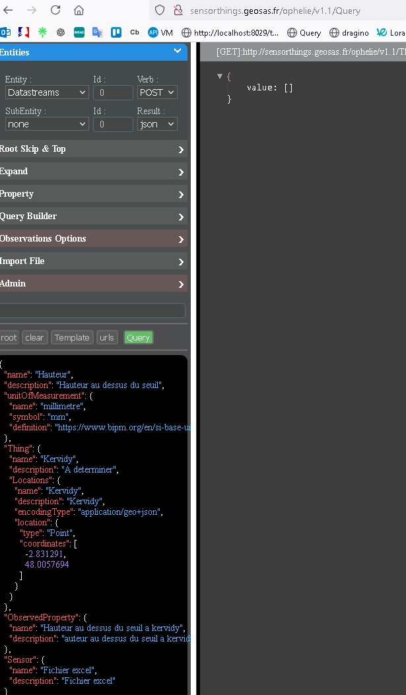
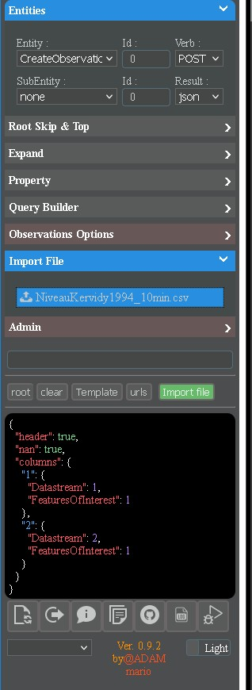

# tuto Ophelie

fichier : NiveauKervidy1994_10min.xlsx

sauver le fichier en csv en supprmant le titre

niveau au dessus du seuil 
date et heure	Hauteur en mm	h (m)
01/01/1994 00:00	566	0,216
01/01/1994 00:10	566	0,216
01/01/1994 00:20	565	0,215

Pour le tuto je vais faire en Datastream et multiDatastream

1 - Creation du service :

https://sensorthings.geosas.fr/service

    
2 Creation des entites :

on POST sur datastream et tout est ok en une fois

mesure du niveau d'eau par une sonde de pression
reconstitution à partir des archives de J. Molénat
vérification de la cohérence avec débits moyens journaliers dans calibration de TNT2


```json
{
    "name": "Hauteur",
    "description": "Hauteur au dessus du seuil",
    "unitOfMeasurement": {
        "name": "millimètre",
        "symbol": "mm",
        "definition": "https://www.bipm.org/en/si-base-units/millimetre"
    },
    "Thing": {
        "name": "Kervidy",
        "description": "A determiner",
        "Locations": {
            "name": "Kervidy",
            "description": "Kervidy",
            "encodingType": "application/geo+json",
            "location": {
                "type": "Point",
                "coordinates": [
                    -2.831291,
                    48.0057694
                ]
            }
        }
    },
    "ObservedProperty": {
        "name": "Hauteur au dessus du seuil a kervidy",
        "description": "auteur au dessus du seuil a kervidy"
    },
    "Sensor": {
        "name": "Fichier excel",
        "description": "Fichier excel"
    }
}
```

Le Second : 

```json
{
    "name": "Hauteur en metre",
    "description": "Hauteur au dessus du seuil",
    "unitOfMeasurement": {
        "name": "mètre",
        "symbol": "m",
        "definition": "https://www.bipm.org/en/si-base-units/metre"
    },
    "Thing": {
        "@iot.name": "Kervidy"
    },
    "ObservedProperty": {
        "@iot.name": "Hauteur au dessus du seuil a kervidy"
    },
    "Sensor": {
        "@iot.name": "Fichier excel"
    }
}
```


on peut verifir et recuperer les ids :    
    http://sensorthings.geosas.fr/ophelie/v1.1/Datastreams

2 Importer le csv en indiquant les datastreams et les colonnes

```json

{
    "header": true,
    "nan": true,
    "columns": {
        "1": {
            "Datastream": 1, 
            "FeaturesOfInterest": 1 
        },
        "2": {
            "Datastream": 2,
            "FeaturesOfInterest": 1
        }
    }
}
```



is tout est ok : 
```json
[
  "Add 52537 on 52543 lines from NiveauKervidy1994_10min.csv"
]
```

du coup on peut : 
parcourir les donnes : http://sensorthings.geosas.fr/ophelie/v1.1/Datastreams(1)/Observations

voir le graph : http://sensorthings.geosas.fr/ophelie/v1.1/Datastreams(1)/Observations?$resultFormat=graph

voir les graph : http://sensorthings.geosas.fr/ophelie/v1.1/Datastreams(1,2)/Observations?$resultFormat=graph


on creer les entites en postant dans multiDatastream :

ATTENTION si le sensor exite deja remplacer par


```json
    "Sensor": {
        "@iot.name": "Kervidy"
    },
```

```json
{
    "name": "Hauteur",
    "description": "Hauteur au dessus du seuil",
    "Thing": {
        "name": "Kervidy",
        "description": "A determiner",
        "Locations": {
            "name": "Kervidy",
            "description": "Kervidy",
            "encodingType": "application/geo+json",
            "location": {
                "type": "Point",
                "coordinates": [
                    -2.831291,
                    48.0057694
                ]
            }
        }
    },
    "Sensor": {
        "name": "Fichier excel",
        "description": "Fichier excel"
    },
    "multiObservationDataTypes": [
        "Measurement",
        "Measurement"
    ],
    "unitOfMeasurements": [
        {
            "name": "Hauteur en mm",
            "symbol": "mm",
            "definition": "http://unitsofmeasure.org/blank.html"
        },
        {
            "name": "Hauteur en m",
            "symbol": "m",
            "definition": "http://unitsofmeasure.org/blank.html"
        }
    ],
    "ObservedProperties": [
        {
            "name": "Hauteur en mm",
            "description": "auteur au dessus du seuil a kervidy en mm"
        },
        {
            "name": "Hauteur en m",
            "description": "auteur au dessus du seuil a kervidy en m"
        }
    ]
}
```


